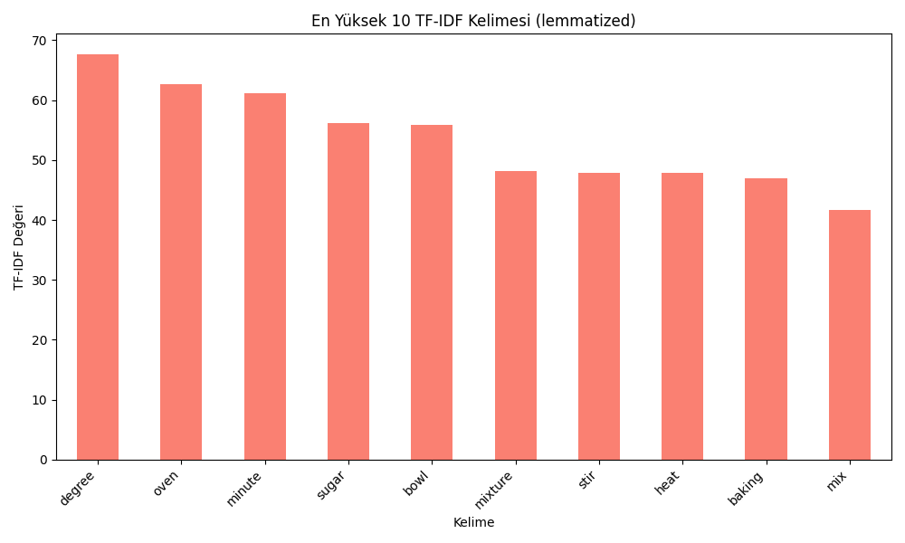
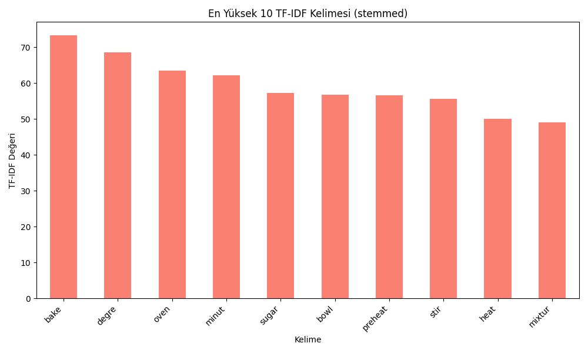
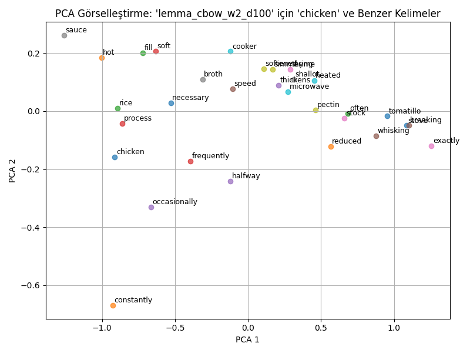
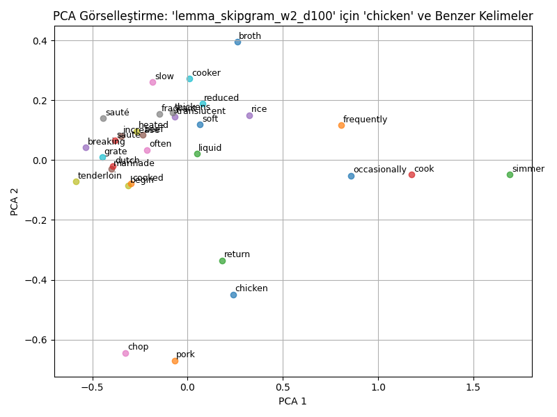
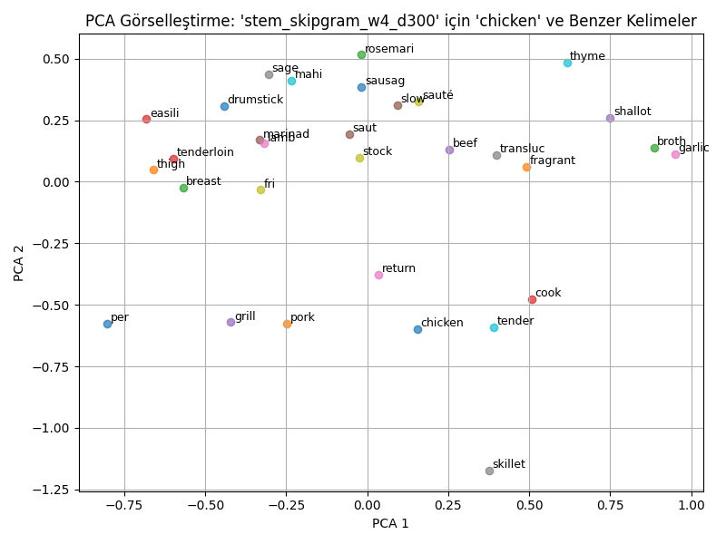
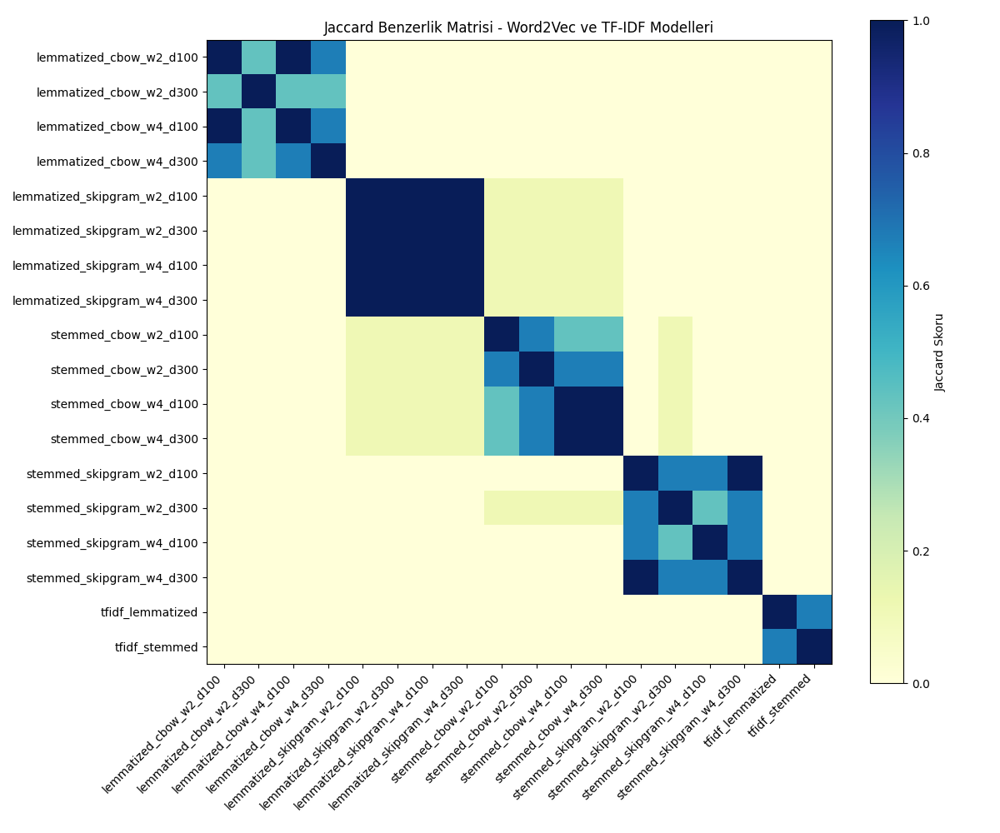

# **Gastronomi Tarif Önerme Projesi**

Bu proje, yemek tariflerini analiz etmek, işlemek ve önerilerde bulunmak için geliştirilmiş bir Python uygulamasıdır. Proje, metin işleme, TF-IDF hesaplama, Word2Vec model eğitimi ve benzerlik analizi gibi çeşitli doğal dil işleme (NLP) tekniklerini içermektedir.

---

## **Projenin Amacı**

Bu projenin temel amacı, yemek tariflerini daha anlaşılır ve işlenebilir bir hale getirmek ve bu tariflerden anlamlı bilgiler çıkararak kullanıcıya önerilerde bulunmaktır. Proje kapsamında şu işlemler gerçekleştirilir:

1. **Veri Ön İşleme**: Tariflerdeki malzeme miktarları, birimler ve sıcaklık değerleri gibi bilgilerin ayrıştırılması ve temizlenmesi.
2. **Metin Analizi**: Tariflerin metin tabanlı analizinin yapılması (örneğin, TF-IDF ve Word2Vec yöntemleriyle).
3. **Benzerlik Analizi**: Tarifler arasındaki benzerliklerin ölçülmesi ve öneri sisteminin oluşturulması.
4. **Görselleştirme**: Tariflerdeki verilerin görselleştirilmesi ve analiz sonuçlarının sunulması.

---

## **Kullanılan Veri Seti**

Bu çalışmada, Kaggle üzerinden erişilebilen **“Better Recipes for a Better Life”** adlı veri seti kullanılmıştır. Veri seti, yemek tariflerini ve bu tariflere ait detayları içermektedir.

- **Boyut**: 1.74 MB
- **Dosyalar**: `recipes.csv` (ham veri) ve `test_recipes.csv`
- **Kullanılan Dosya**: `recipes.csv`

**Kaggle Veri Seti Linki**:  
[https://www.kaggle.com/datasets/thedevastator/better-recipes-for-a-better-life](https://www.kaggle.com/datasets/thedevastator/better-recipes-for-a-better-life)

---

## **Proje Yapısı**

Proje dosyaları ve klasörleri aşağıdaki gibi organize edilmiştir

Gastronomi_Tarif_Onerme/< ├── data/                      # Veri setleri ve işlenmiş veriler │   ├── recipes_cleaned.csv    # Temizlenmiş tarif verileri │   ├── tfidf_lemmatized_results.csv  # TF-IDF sonuçları (lemmatized) │   ├── lemmatized.cvs  # Lemma yapılmış veriler │   ├── stemmed.cvs  # stem yapılmış veriler │   ├── tfidf_stemmed_results.csv     # TF-IDF sonuçları (stemmed) │   └── veriseti/              # Ham veri setleri │       └── recipes.csv ├── gorsel/                    # Görselleştirme sonuçları │   ├── tf-ıdf/                # TF-IDF görselleştirme sonuçları │   ├── calculate_wordvec      # TF_IDF benzerlik ortalama sonuçları │   ├── cosine                 # Word2vec benzerlik oranları │   └── word2vec/              # Word2Vec görselleştirme sonuçları ├── model/                     # Eğitimli Word2Vec modelleri ├── rapor_cikti/               # Analiz sonuçları ve rapor çıktıları ├── src/                       # Kaynak kodlar │   ├── gastronomi_preprocessing.py  # Veri ön işleme kodları │   ├── tf-ıdf.py                     # TF-IDF hesaplama kodları │   ├── word2vec.py                   # Word2Vec model eğitimi │   ├── cosine_similarity_TF-ıdf.py   # TF-IDF benzerlik analizi │   ├── calculate_avarge.Wordvec.py   # Word2Vec benzerlik analizi │   └── evaluation_and_comparison.py  # Sonuçların değerlendirilmesi └── README.md                  # Proje açıklama dosyası 

---

## **Kurulum**

1. **Gerekli Kütüphaneleri Yükleyin**:
   bash
   pip install pandas numpy matplotlib nltk gensim scikit-learn
   

2. **NLTK Modüllerini İndirin**:
   python
   import nltk
   nltk.download('punkt')
   nltk.download('stopwords')
   nltk.download('wordnet')
   

3. **Veri Setlerini Yerleştirin**:
   Ham veri setlerini veriseti klasörüne yerleştirin.

4. **Proje Dosyalarını Çalıştırın**:
   - **Veri Ön İşleme**: gastronomi_preprocessing.py
   - **TF-IDF Hesaplama**: tf-ıdf.py
   - **Word2Vec Model Eğitimi**: word2vec.py
   - **Benzerlik Analizi**: cosine_similarity_TF-ıdf.py ve calculate_avarge.Wordvec.py
   - **Sonuçların Değerlendirilmesi**: evaluation_and_comparison.py

---

## **Kullanılan Teknolojiler ve Kütüphaneler**

- **Python**: Projenin temel programlama dili.
- **Pandas**: Veri işleme ve analiz için.
- **NumPy**: Sayısal hesaplamalar için.
- **NLTK**: Doğal dil işleme işlemleri için.
- **Matplotlib**: Veri görselleştirme için.
- **Scikit-learn**: TF-IDF hesaplama ve cosine similarity işlemleri için.
- **Gensim**: Word2Vec modelleri oluşturmak için.

---

## **Önemli Dosyalar ve İşlevleri**

### **1. evaluation_and_comparison.py**
- **İşlevi**: 
  - Bu dosya, Word2Vec ve TF-IDF modellerinin performansını değerlendirir ve karşılaştırır.
  - Modellerin sıraladığı ilk 5 metin arasındaki **Jaccard benzerlik skorlarını** hesaplar.
  - **Anlamsal skorlar**, **benzerlik skorları** ve **Jaccard benzerlik matrisi** gibi sonuçları CSV dosyalarına kaydeder.
- **Çıktılar**:
  - anlamsal_skorlar_word2vec_tfidf_models.csv
  - benzerlik_skorlari_word2vec_tfidf_models.csv
  - jaccard_matrix_word2vec_tfidf_models.csv

---

### **2. calculate_avarge.Wordvec.py**
- **İşlevi**:
  - Word2Vec modelleri kullanılarak tarifler arasındaki **ortalama benzerlik skorlarını** hesaplar.
  - Modellerin performansını görselleştirir ve sonuçları grafik olarak kaydeder.
- **Çıktılar**:
  - Görseller: `gorsel/word2vec/lemmatized_models_similarity.png`, `gorsel/word2vec/stemmed_models_similarity.png`
  - Ortalama benzerlik skorları: benzerlik_skorlari_word2vec_tfidf_models.csv

---

### **3. tf-ıdf.py**
- **İşlevi**:
  - Tariflerin metinlerinden **TF-IDF (Term Frequency-Inverse Document Frequency)** değerlerini hesaplar.
  - Lemmatize edilmiş ve stemlenmiş metinler için ayrı ayrı TF-IDF sonuçlarını oluşturur.
  - TF-IDF sonuçlarını görselleştirir ve CSV dosyalarına kaydeder.
- **Çıktılar**:
  - tfidf_lemmatized_results.csv
  - tfidf_stemmed_results.csv
  - Görseller: top_10_tfidf_lemmatized.png, top_10_tfidf_stemmed.png

---

### **4. word2vec.py**
- **İşlevi**:
  - Tariflerin metinlerinden **Word2Vec modellerini** eğitir.
  - CBOW ve Skip-Gram yapılandırmaları ile farklı pencere boyutları ve vektör boyutları kullanılarak modeller oluşturur.
  - Eğitilen modellerin kelime vektörlerini görselleştirir.
- **Çıktılar**:
  - Eğitimli modeller: `model/lemmatized_cbow_w2_d100.model`, `model/stemmed_skipgram_w4_d300.model`
  - Görseller: lemma_cbow_w2_d100_pca_comparison.png, stem_skipgram_w4_d300_pca_comparison.png

---

### **5. anlamsal_skorlar_word2vec_tfidf_models.csv**
- **İçeriği**:
  - Her modelin sıraladığı ilk 5 metin için **anlamsal değerlendirme skorlarını** içerir.
  - Örnek:
    Model,Anlamsal Skor
    lemmatized_cbow_w2_d100,4.4
    lemmatized_cbow_w2_d300,4.6
    tfidf_lemmatized,3.8
    

---

### **6. benzerlik_skorlari_word2vec_tfidf_models.csv**
- **İçeriği**:
  - Her modelin sıraladığı ilk 5 metin için **ortalama benzerlik skorlarını** içerir.
  - Örnek:
    Model,Benzerlik Skoru
    lemmatized_cbow_w2_d100,0.9986
    lemmatized_cbow_w2_d300,0.9993
    tfidf_lemmatized,0.8961
    

---

### **7. jaccard_matrix_word2vec_tfidf_models.csv**
- **İçeriği**:
  - Modellerin sıraladığı ilk 5 metin arasındaki **Jaccard benzerlik skorlarını** içerir.
  - Örnek:
    lemmatized_cbow_w2_d100,lemmatized_cbow_w2_d300,tfidf_lemmatized
    lemmatized_cbow_w2_d100,1.0,0.43,0.0
    lemmatized_cbow_w2_d300,0.43,1.0,0.0
    tfidf_lemmatized,0.0,0.0,1.0

---

### **8. recipes_cleaned.csv**
- **İçeriği**:
  - Temizlenmiş ve işlenmiş tarif verilerini içerir.
  - Örnek:
    RecipeID,Directions
    1,Preheat oven to 350 degrees. Mix flour and sugar.
    2,Boil water and add pasta. Cook for 10 minutes.

---

### **9. Görselleştirme Dosyaları**
- **TF-IDF Görselleri**:
  - top_10_tfidf_lemmatized.png
  - top_10_tfidf_stemmed.png
- **Word2Vec Görselleri**:
  - lemma_cbow_w2_d100_pca_comparison.png
  - stem_skipgram_w4_d300_pca_comparison.png
- **Jaccard Benzerlik Matrisi**:
  - jaccard_matrix_word2vec_tfidf_models.png

---

Bu açıklamaları README dosyanıza ekleyerek, projenizin önemli dosyalarını ve işlevlerini detaylı bir şekilde açıklayabilirsiniz. Eğer başka bir dosya veya detay eklemek isterseniz, lütfen belirtin!

## **Sonuçlar ve Görselleştirme**
### TF-IDF En Yüksek 10 Kelime

### Word2Vec PCA Görselleştirme

### **TF-IDF Görselleştirme**
- **En Yüksek 10 Kelime (Lemmatized)**:
  
- **En Yüksek 10 Kelime (Stemmed)**:
  

### ** Word2Vec Görselleştirme**
- **CBOW Modeli (Window=2, Dimension=100)**:
  
- **Skip-Gram Modeli (Window=4, Dimension=300)**:
  

### ** Jaccard Benzerlik Matrisi**
- **Word2Vec ve TF-IDF Modelleri Arasındaki Örtüşme**:
  
  

---

## **Sonuç ve Öneriler**

1. **TF-IDF Modelleri**:
   - Hızlı ve yüzeysel analizler için uygundur.
   - Anlamsal ilişkileri dikkate almadığı için derin analizlerde sınırlıdır.

2. **Word2Vec Modelleri**:
   - Anlamsal ilişkileri yakalamada başarılıdır.
   - CBOW modelleri kısa metinler için daha uygundur, Skip-Gram modelleri ise daha geniş bağlamları yakalar.

3. **Öneriler**:
   - Görev türüne göre TF-IDF ve Word2Vec modelleri birlikte kullanılabilir.
   - Daha büyük veri setleriyle modellerin performansı artırılabilir.

---

## **Proje Çıktıları**

### **1. Ortalama Benzerlik Skorları**
| Model                          | Ortalama Benzerlik Skoru |
|--------------------------------|--------------------------|
| lemmatized_cbow_w2_d100        | 0.9986                  |
| lemmatized_cbow_w2_d300        | 0.9993                  |
| lemmatized_cbow_w4_d100        | 0.9987                  |
| lemmatized_cbow_w4_d300        | 0.9991                  |
| lemmatized_skipgram_w2_d100    | 0.9961                  |
| lemmatized_skipgram_w2_d300    | 0.9968                  |
| tfidf_lemmatized               | 0.8961                  |
| tfidf_stemmed                  | 0.7819                  |

### **2. Anlamsal Değerlendirme Skorları**
| Model                          | Ortalama Anlamsal Skor |
|--------------------------------|------------------------|
| lemmatized_cbow_w2_d100        | 4.4                  |
| lemmatized_cbow_w2_d300        | 4.6                  |
| lemmatized_cbow_w4_d100        | 4.4                  |
| lemmatized_cbow_w4_d300        | 4.6                  |
| lemmatized_skipgram_w2_d100    | 3.8                  |
| lemmatized_skipgram_w2_d300    | 3.8                  |
| tfidf_lemmatized               | 3.8                  |
| tfidf_stemmed                  | 3.0                  |

---

Bu proje, yemek tarifleri arasındaki benzerlikleri analiz etmek ve önerilerde bulunmak için güçlü bir temel sunmaktadır. Daha fazla geliştirme için, daha büyük veri setleri ve daha gelişmiş modeller (örneğin, BERT veya GPT) kullanılabilir.
